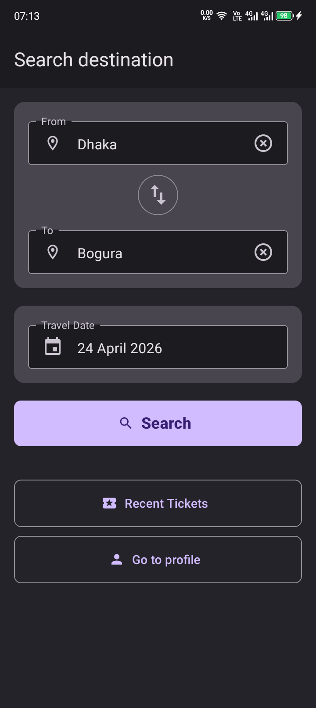
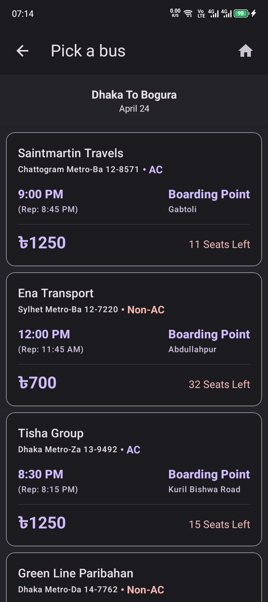
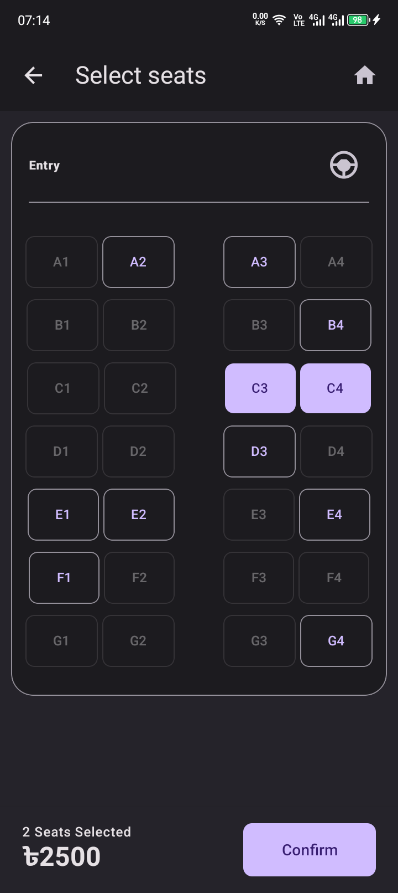
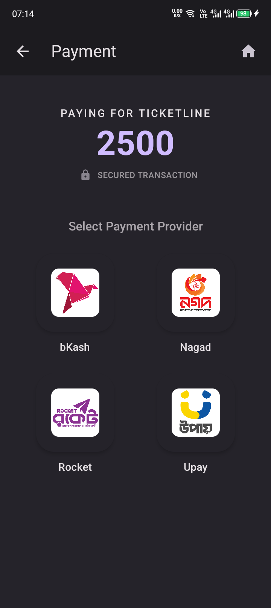
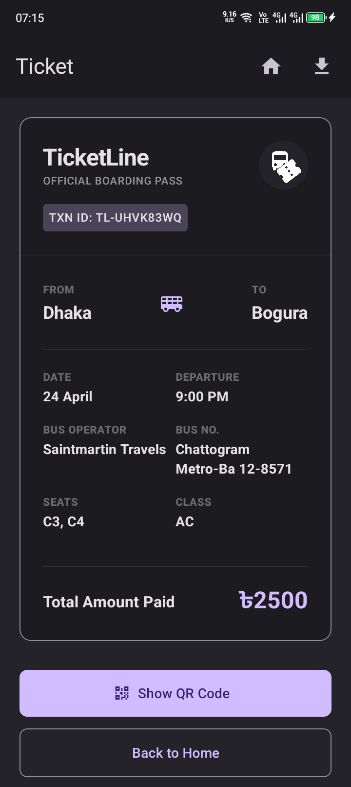

# TicketLine

A React Native bus ticket booking app built with Expo.

## Overview

TicketLine is a mobile app for booking bus tickets that mirrors a real-world booking experience. Users can search available buses, pick seats, and complete the booking process, all powered by a fully client-side system that generates data on the fly.

## Project Context

TicketLine was developed as a college group project. I served as the team lead and was responsible for the complete application development, including architecture, implementation, and core feature design. The rest of the team contributed to non-technical aspects of the project.

## Features

- Browse available buses between cities
- Seat selection with live availability
- Booking summary flow
- Dynamic data simulation (no backend required)

## Data Simulation Engine

Instead of a backend, TicketLine uses a custom-built data generator that simulates:

- Route-based bus availability
- Seat occupancy per trip
- Pricing variations
- Departure and reporting times
- Boarding points

This enables a fully functional booking flow entirely on the client side.

## Tech Stack

- React Native (Expo)
- TypeScript
- React Native Paper (UI components)

## Screenshots

| Search                                                 | Results                                                | Seat Selection                                         |
| ------------------------------------------------------ | ------------------------------------------------------ | ------------------------------------------------------ |
|  |  |  |

| Payment                                                | Ticket                                                 |
| ------------------------------------------------------ | ------------------------------------------------------ |
|  |  |

## Getting Started

```bash
git clone https://github.com/mjobayed/ticketline.git
cd ticketline
npm install
npx expo start
```

## License

MIT
